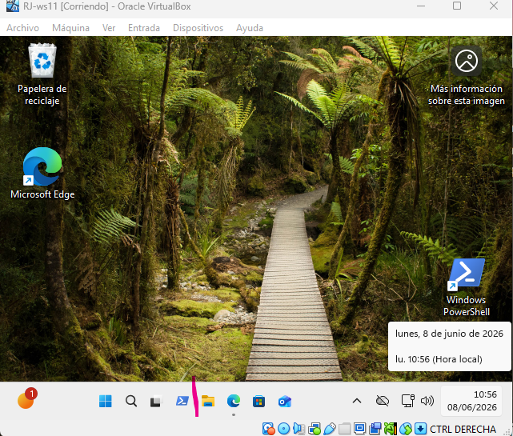
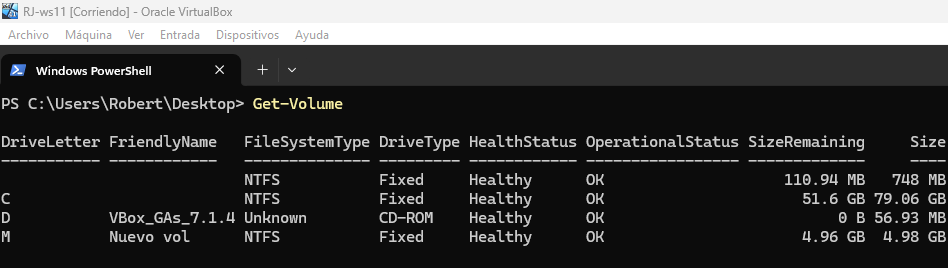

# Práctica 1. Exploración del sistema de archivos y estructura de directorios en Windows 11

En esta práctica realizarás una exploración inicial de los sistemas de archivos, las herramientas de gestión (gráficas y por comandos) y la estructura de directorios en un entorno **Windows 11 Pro**. Conocerás cómo identificar el sistema de archivos del disco, navegar por las carpetas principales y utilizar herramientas como el **Explorador de archivos** y **PowerShell** para obtener información detallada.

### Objetivos de la práctica
* Identificar el sistema de archivos del equipo.
* Gestionar archivos y directorios mediante herramientas gráficas y PowerShell.
* Reconocer la estructura de directorios del sistema.
* Comprender la función de las carpetas principales.

---

## Ejercicio 1. Identificación y análisis del sistema de archivos

### Parte A. Comprobación con interfaz gráfica

1. Prueba 5 formas diferentes de acceso al **Explorador de archivos**.

> **CONFIGURACIÓN / TEORÍA: Explorador de archivos**
> 
> El **Explorador de archivos** es la herramienta gráfica de Windows que permite navegar, organizar y gestionar archivos, carpetas y unidades del sistema. Ofrece una vista jerárquica del sistema de archivos y acceso rápido a ubicaciones frecuentes como *Este equipo*, *Descargas* o *Documentos*.
> 
> Existen diversas **formas de acceder al Explorador de archivos**:
> 1. **Icono de la barra de tareas:** Haz clic en el icono del *Explorador de archivos* anclado en la barra de tareas.



> 2. **Atajo de teclado:** Pulsa **Windows + E**.


> 3. **Menú Inicio (búsqueda):** Abre el *Menú Inicio*, escribe *Explorador de archivos* y pulsa *Enter*.


> 4. **Menú Inicio (acceso directo):** Abre el *Menú Inicio*. Si aparece el icono de *Explorador de archivos* en la parte superior o lateral, haz clic sobre él.


> 5. **Menú contextual avanzado (Win + X):** Pulsa **Windows + X** y selecciona *Explorador de archivos* en el menú.


2. Una vez estés en el Explorador de archivos, identifica el panel izquierdo y selecciona **Este equipo**.
3. Localiza la unidad **C:** (unidad del sistema).
4. Haz clic derecho sobre **C:** → **Propiedades**.
5. Busca el campo **Sistema de archivos** e identifica si es NTFS, FAT32, etc.
6. Justifica por qué Windows 11 utiliza ese sistema de archivos.

 

Windows 11 utiliza NTFS (New Technology File System) como su sistema de archivos principal por defecto debido a una combinación de seguridad, estabilidad, compatibilidad heredada y funciones avanzadas que los sistemas de archivos más antiguos (como FAT32) simplemente no pueden ofrecer.
---

### Parte B. Comprobación mediante PowerShell

1. Prueba 5 formas diferentes de acceder a **PowerShell**.

>  **CONFIGURACIÓN / TEORÍA: PowerShell**
> 
> **PowerShell** es una consola avanzada de administración que permite ejecutar comandos, automatizar tareas mediante scripts y gestionar prácticamente cualquier aspecto del sistema operativo.
> 
> Existen diversas formas de **abrir PowerShell** en Windows 11:
> 1. **Menú Inicio (búsqueda rápida):** Abre el *Menú Inicio*, escribe *PowerShell*, pulsa *Enter* o haz clic en *Windows PowerShell*.


> 2. **Atajo de teclado (Win + X):** Pulsa **Windows + X** para abrir el menú avanzado y selecciona *Windows PowerShell* o *Windows PowerShell (Administrador)*.


> 3. **Cuadro de Ejecutar (Win + R):** Pulsa **Windows + R**, escribe `powershell` y pulsa *Enter*. Para abrirlo como administrador:
>    ``` ```
>powershell
>    powershell -Command "Start-Process powershell -Verb runAs"
>    ```


> 4. **Desde el Explorador de archivos:** Navega a cualquier carpeta, haz clic en la barra de direcciones, escribe `powershell` para abrirlo *en esa ruta*.


2. Abre la aplicación **Windows PowerShell**.

3. Ejecuta el siguiente comando:

powershell
Get-Volume


Su función principal es darte un informe rápido y detallado sobre el estado de todos los discos, 
particiones y unidades de almacenamiento (discos duros, SSD, pendrives USB) que están conectados a tu ordenador en ese momento

## Comprueba que el sistema de archivos coincide con el visto en la interfaz gráfica.



# Ejercicio 2. Gestión del sistema de archivos mediante herramientas gráficas

    Abre el Explorador de archivos.
    Activa Ver → Mostrar → Elementos ocultos para visualizar carpetas del sistema.
    Explora las siguientes rutas una por una:
        C:\
        C:\Windows
        C:\Program Files
        C:\Users
        C:\ProgramData
    En cada carpeta:
        Observa su contenido.
        Identifica qué tipo de archivos o subcarpetas contiene.
        Trata de deducir su función general dentro del sistema.
    Registra brevemente la función de cada directorio principal.


## En cada carpeta:

    Observa su contenido.
    Identifica qué tipo de archivos o subcarpetas contiene.
    Trata de deducir su función general dentro del sistema.

Registra brevemente la función de cada directorio principal.

---

## Ejercicio 3. Gestión del sistema de archivos mediante comandos (PowerShell)

    Abre PowerShell.
    Ejecuta:

|Get-ChildItem C:\


Observa qué elementos aparecen en la raíz del sistema.

---
4.
    Ejecuta ahora:

Get-ChildItem C:\Windows -Directory


---

## Analiza las carpetas mostradas y compáralas con lo visto en el Explorador.
    Ejecuta:

Get-Item C:\Users

    Observa los metadatos que aparecen (tamaño, atributos, etc.).


# Ejercicio 4. Estructura de directorios: análisis y funciones

# Localiza y examina estas carpetas clave:
        C:\Windows → archivos esenciales del sistema operativo.


        C:\Program Files → aplicaciones instaladas de 64 bits.


        C:\Program Files (x86) → aplicaciones de 32 bits.


        C:\Users → perfiles y datos de usuario.

        C:\ProgramData → datos compartidos y configuraciones globales.


    Describe qué función cumple cada carpeta.
    Indica qué tipo de información contiene cada una:
        Archivos del sistema
        Programas instalados
        Configuraciones
        Datos de usuario
        Datos globales o compartidos
---

## Ejercicio 5. Rutas absolutas y relativas

    Abre PowerShell.
    Ejecuta:

Get-Location


    Anota la ruta actual.
    Cambia de carpeta usando:

Set-Location C:\Windows

    Vuelve al directorio anterior con:

Set-Location ..

    Vuelve a ejecutar:

Get-Location


    Explica:
        Qué es una ruta absoluta.
        Qué es una ruta relativa.
        Qué ejemplos has utilizado en este ejercicio.