# como encontrar el explorador

## explorador por barra
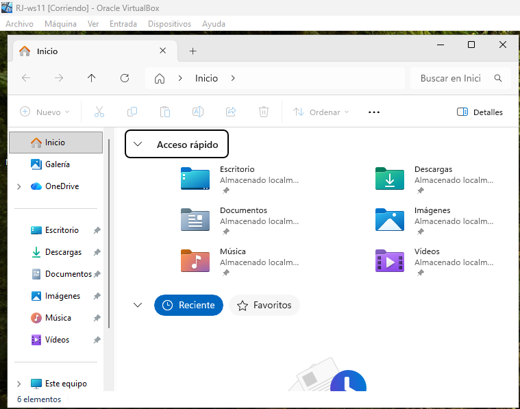

## windows + E

## windows + R
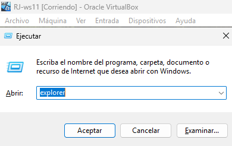

## control + shift + esc
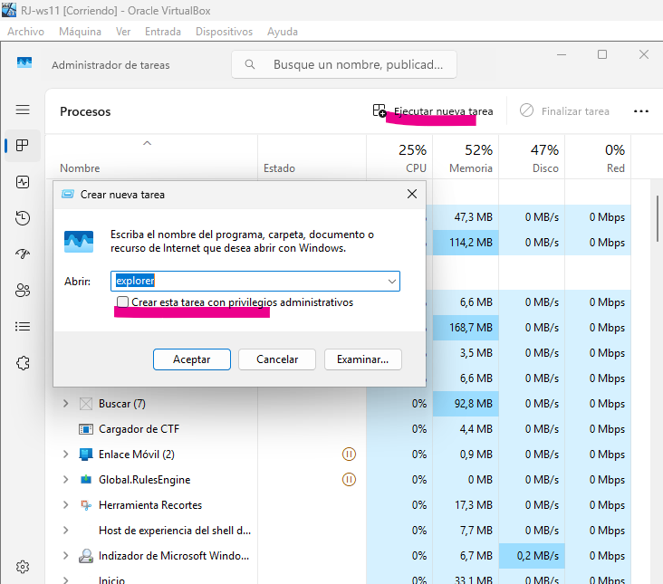

## windows + X
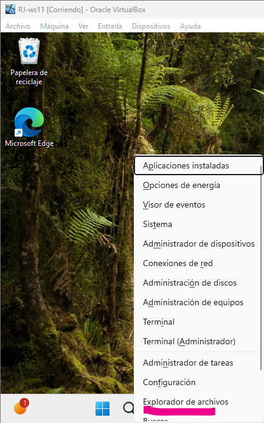
-------------------------------

# parte 2

Una vez estés en el Explorador de archivos, identifica el panel izquierdo y selecciona Este equipo.
Localiza la unidad C: (unidad del sistema).
Haz clic derecho sobre C: → Propiedades.
Busca el campo Sistema de archivos e identifica si es NTFS, FAT32, etc.
Justifica por qué Windows 11 utiliza ese sistema de archivos.

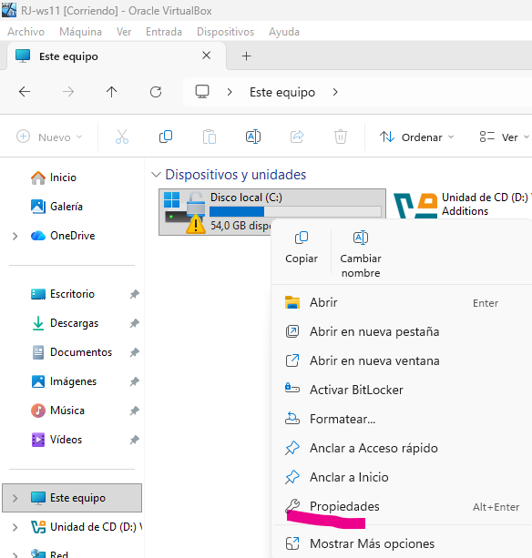 "juntos"
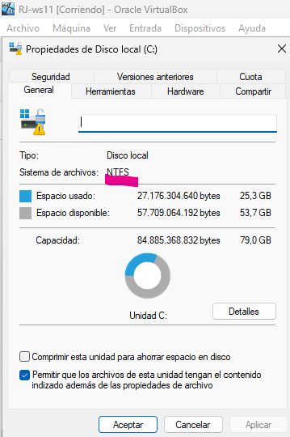

Windows 11 utiliza NTFS (New Technology File System) como su sistema de archivos principal por defecto debido a una combinación de seguridad, estabilidad, compatibilidad heredada y funciones avanzadas que los sistemas de archivos más antiguos (como FAT32) simplemente no pueden ofrecer.

-------------------------------

## Parte B. Comprobación mediante PowerShell
    
# Prueba 5 formas diferentes de acceder a PowerShell.

Existen diversas formas de abrir PowerShell en Windows 11:

    Menú Inicio (búsqueda rápida)
        Abre el Menú Inicio.
        Escribe PowerShell.
        Pulsa Enter o haz clic en Windows PowerShell.
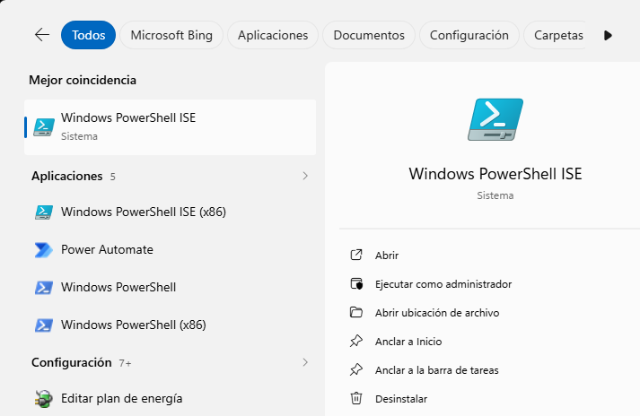

    

    Atajo de teclado (Win + X)
        Pulsa Windows + X para abrir el menú avanzado.
        Selecciona Windows PowerShell o Windows PowerShell (Administrador).
        (En algunas versiones aparece Windows Terminal, explicado más abajo.)
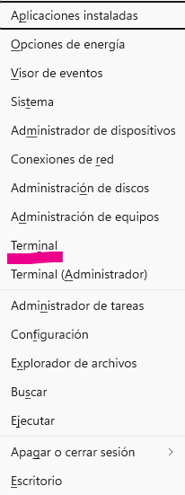

    Cuadro de Ejecutar (Win + R)
        Pulsa Windows + R.
        Escribe powershell y pulsa Enter.
        Para abrirlo como administrador:

        "powershell -Command "Start-Process powershell -Verb runAs"

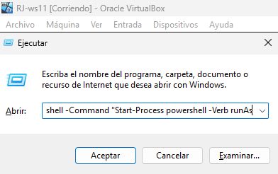

    Desde el Explorador de archivos
        Navega a cualquier carpeta.
        Haz clic en la barra de direcciones.
        Escribe powershell para abrirlo en esa ruta.

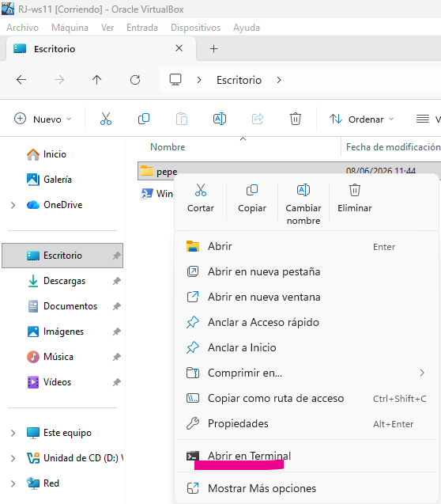

    Desde una ventana CMD

        CMD (Símbolo del sistema): consola antigua basada en texto, menos potente que PowerShell.

        Si tienes abierto CMD, escribe:

        powershell

# 2. Abre la aplicación Windows PowerShell.
    Ejecuta:

    Get-Volume

## que es get-volumen?
Su función principal es darte un informe rápido y detallado sobre el estado de todos los discos, 
particiones y unidades de almacenamiento (discos duros, SSD, pendrives USB) que están conectados a tu ordenador en ese momento

## Comprueba que el sistema de archivos coincide con el visto en la interfaz gráfica.

# Ejercicio 2. Gestión del sistema de archivos mediante herramientas gráficas

    Abre el Explorador de archivos.
    Activa Ver → Mostrar → Elementos ocultos para visualizar carpetas del sistema.
    Explora las siguientes rutas una por una:
        C:\
        C:\Windows
        C:\Program Files
        C:\Users
        C:\ProgramData
    En cada carpeta:
        Observa su contenido.
        Identifica qué tipo de archivos o subcarpetas contiene.
        Trata de deducir su función general dentro del sistema.
    Registra brevemente la función de cada directorio principal.

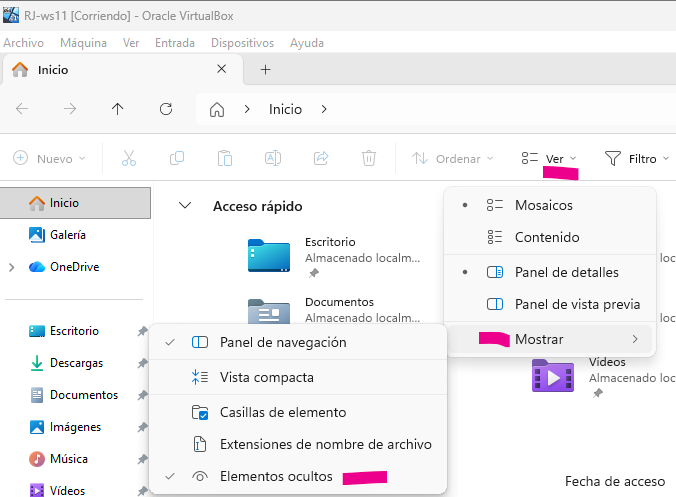

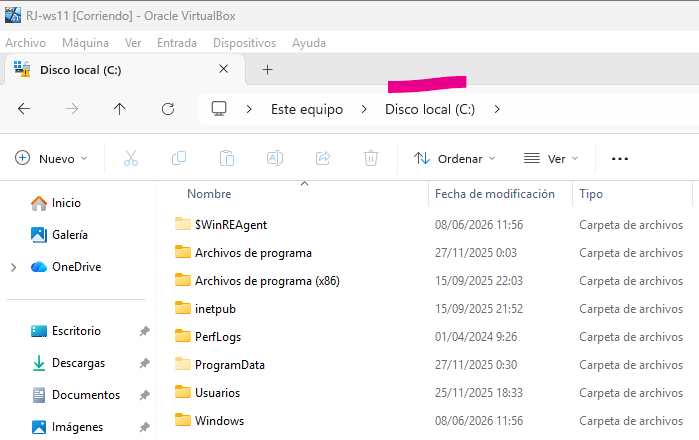

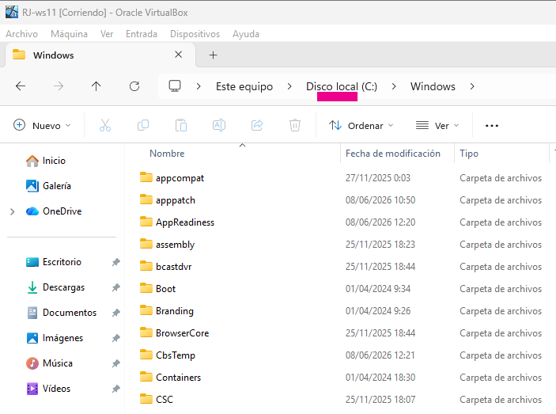

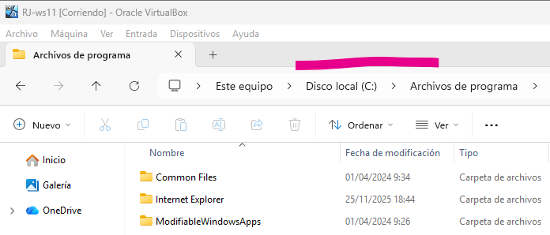

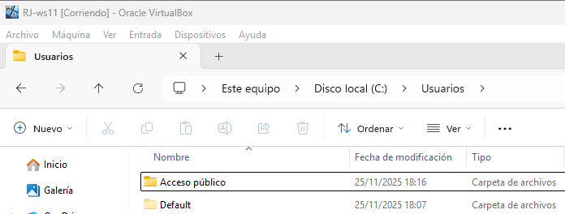

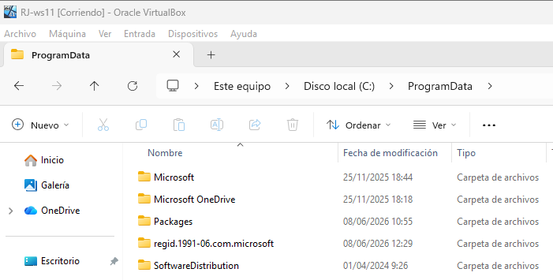

## En cada carpeta:

    Observa su contenido.
    Identifica qué tipo de archivos o subcarpetas contiene.
    Trata de deducir su función general dentro del sistema.

Registra brevemente la función de cada directorio principal.

---

## Ejercicio 3. Gestión del sistema de archivos mediante comandos (PowerShell)

    Abre PowerShell.
    Ejecuta:

|Get-ChildItem C:\

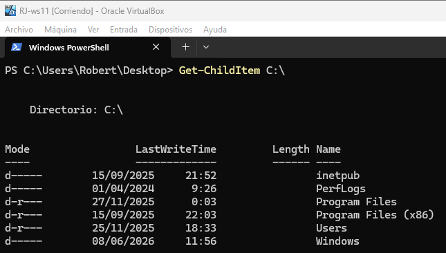

Observa qué elementos aparecen en la raíz del sistema.

---
4.
    Ejecuta ahora:

Get-ChildItem C:\Windows -Directory

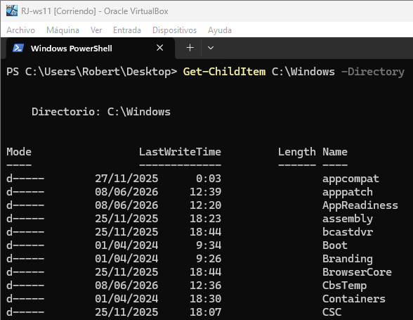

---

## Analiza las carpetas mostradas y compáralas con lo visto en el Explorador.
    Ejecuta:

Get-Item C:\Users

    Observa los metadatos que aparecen (tamaño, atributos, etc.).

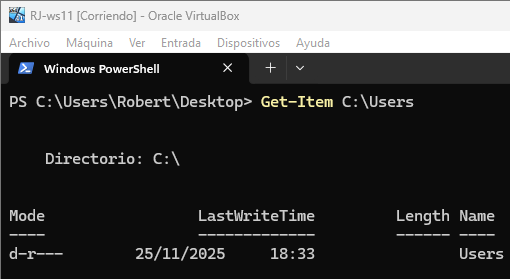

# Ejercicio 4. Estructura de directorios: análisis y funciones

# Localiza y examina estas carpetas clave:
        C:\Windows → archivos esenciales del sistema operativo.

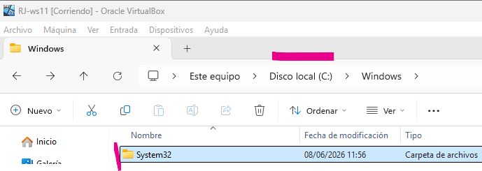

        C:\Program Files → aplicaciones instaladas de 64 bits.
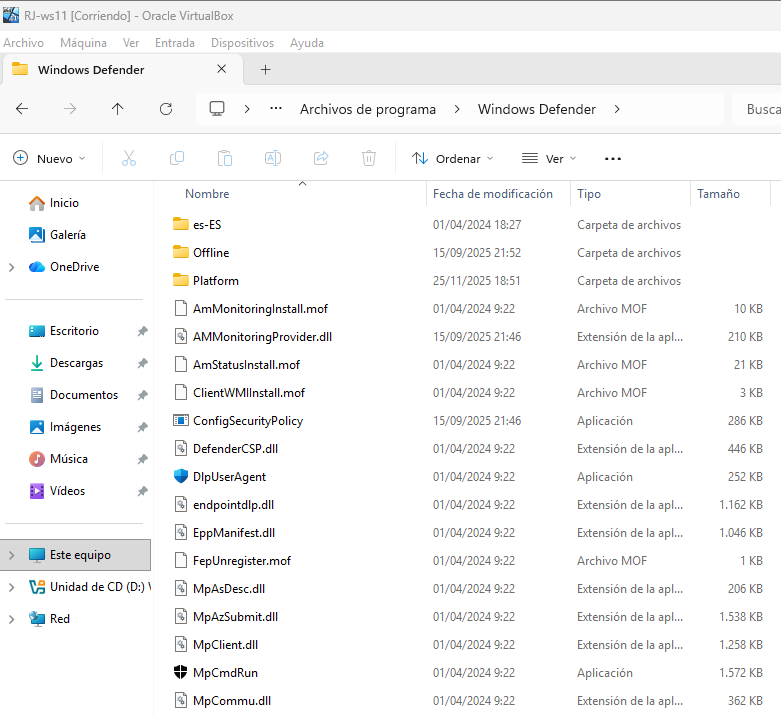

        C:\Program Files (x86) → aplicaciones de 32 bits.
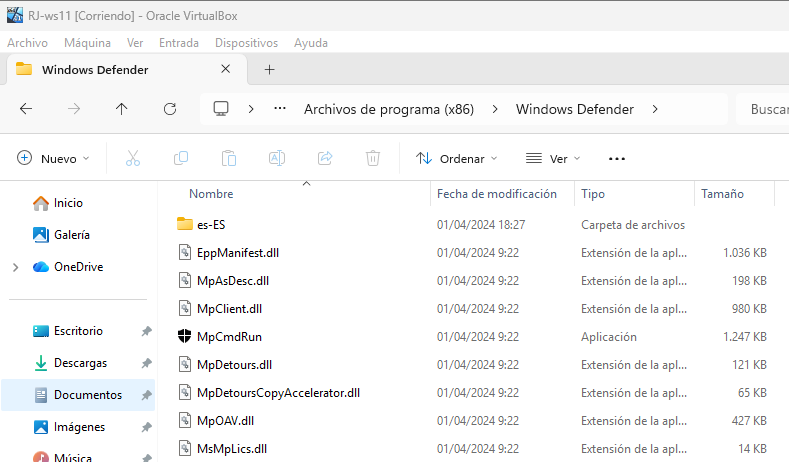

        C:\Users → perfiles y datos de usuario.
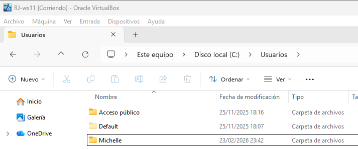
        C:\ProgramData → datos compartidos y configuraciones globales.
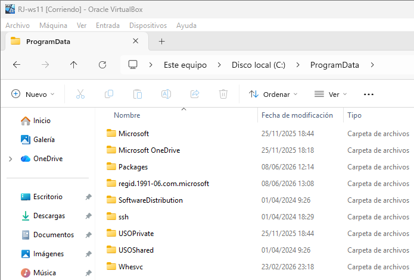

    Describe qué función cumple cada carpeta.
    Indica qué tipo de información contiene cada una:
        Archivos del sistema
        Programas instalados
        Configuraciones
        Datos de usuario
        Datos globales o compartidos
---

## Ejercicio 5. Rutas absolutas y relativas

    Abre PowerShell.
    Ejecuta:

Get-Location

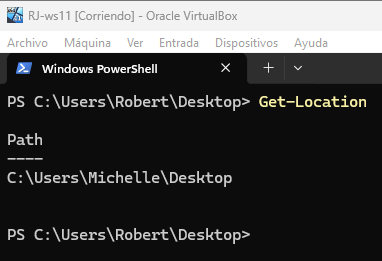

    Anota la ruta actual.
    Cambia de carpeta usando:

Set-Location C:\Windows
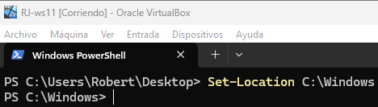
    Vuelve al directorio anterior con:

Set-Location ..
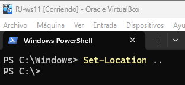
    Vuelve a ejecutar:

Get-Location
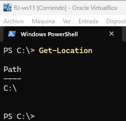

    Explica:
        Qué es una ruta absoluta.
        Qué es una ruta relativa.
        Qué ejemplos has utilizado en este ejercicio.